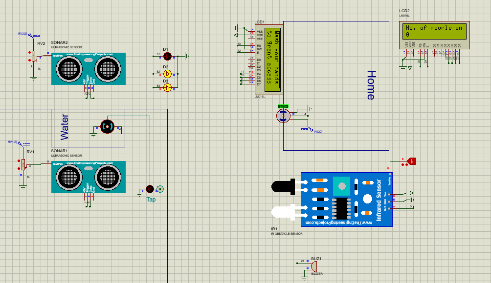

# Touchless Faucet with Door control system
## `Schematic Diagram`   
  
## `Description`  
- Firstly, users will need to place their hands in front of the faucet and then the ultrasonic sensor will detect that and send signals to start the pump. The sanitizer flow will be stopped when the faucet is not in use. 
- After disinfecting their hands, they need to place their hands in front of the IR tracking sensor at the door. 
- The door will open and show a welcome message in LCD. The door will be closed automatically after a few seconds. 
- If any user tries to enter without washing his hand, the door will not be opened, buzzer will sound an alarm and also a warning will be displayed to the LCD display.
- There is also an LCD that displays the number of people staying in the room to maintain social distance.
